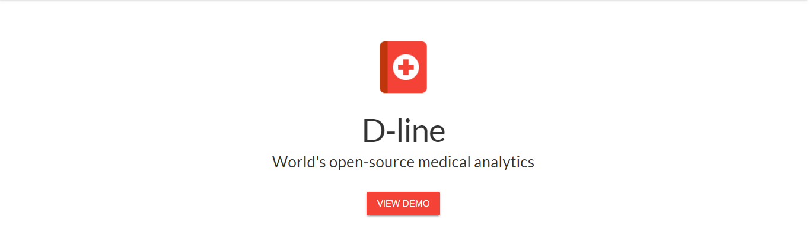
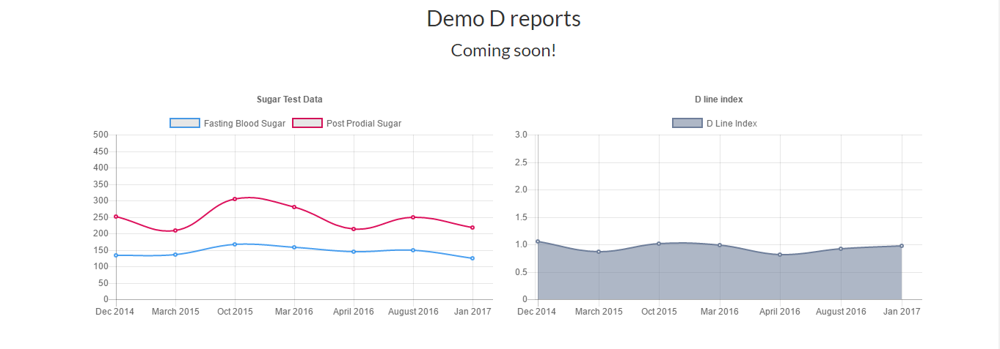

# D-line (Web App)

D-line is just a personal thought ended up being a repository here. Its currently in development. The functions and features will be elaborated when time comes but as of now you can settle it as an analysis of your medical report which virtualised the results in the form of charts enabling you understand the better YOU.

NOTE: The setup instructions will be updated once the app passes out of beta phase. 

## Prerequisites on your local machine 
1. Node.js
2. npm
3. MongoDB 
 

## How to Install D-line locally
1. Clone the D-line repository using `git clone <url>`
2. Run`npm install` from the directory
3. The command line will install necessary pakage files
4. Start mongod service
5. Run `node app.js` to start the D-line
6. Open your browser at `localhost:3000`

Web demo link: http://www.mohammadshahebaz.com/github/dline/

## Troubleshooting
- If you get an NPM ERR!! code while executing `npm install`. 
- Delete the node_modules directly and follow from Step 2 again

### Note
- Don't run the `npm install xxx --save` with `sudo` permissions on Ubuntu. It will change the permissions of package.json to root and you can't modify it for development purpose unless you run `chmod 755` to own the package.json again. 

